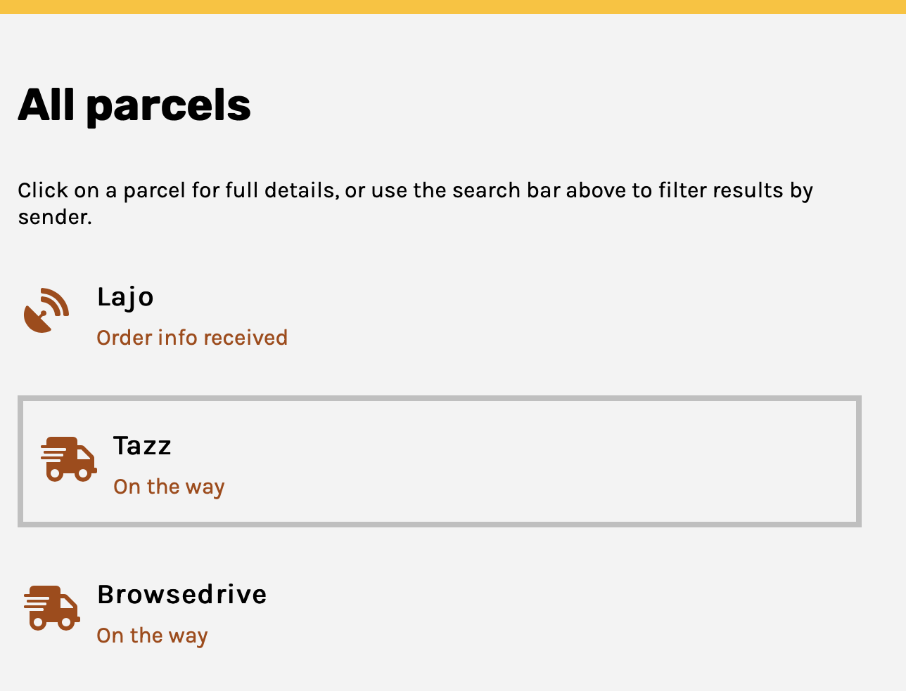

# YellowCorp package tracker

A simple web app that displays a list of orders (or parcels). \
More details are shown when the user clicks on a particular parcel, for example: order status, ETAs, pickup location.

This project was created as a student project for Software Development Academy (SDA). \
It was bootstrapped with [Create React App](https://github.com/facebook/create-react-app) and supports major mobile and desktop browsers/layouts.

The web app is hosted at https://package-tracker-sda9.web.app/

## Available Scripts

In the project directory, you can run:

### `npm install`

Installs the dependencies (read on for details) in the local node_modules folder.

### `npm start`

Runs the app in the development mode.\
Open [http://localhost:3000](http://localhost:3000) to view it in the browser.

The page will reload if you make edits.\
You will also see any lint errors in the console.

### `npm run build`

Builds the app for production to the `build` folder.\
It correctly bundles React in production mode and optimizes the build for the best performance.

The build is minified and the filenames include the hashes.\
The app is then ready to be deployed!

See the section about [deployment](https://facebook.github.io/create-react-app/docs/deployment) for more information.

## Usage

### Home page

Get started by clicking the link to view all parcels or search for a parcel by sender name using the search bar in the header.
 
Figure 1: Home page on desktop view

 

### All parcels page

View an overview of all tracked parcels. \
Sender name and order status with matching icon are displayed for each parcel. \
Figure 2: All parcels page on desktop view

 
Click on a parcel to see further details. \
Figure 3: Hovering over a parcel on desktop view

 

### Parcel details page

Get more details about a parcel. \
Some values have been formatted to use more natural language (eg date , booleans and null).

Figure 4: Parcel details on desktop view

### Searching

All pages include a search bar in the header, which searches for parcels based on sender name.

### Search results page

Search results include part matches. Eg searching for "oo" will return parcels sent by "Cogidoo" and "Voomm" \
Click on a parcel result to see the details.

Figure 5: Search results showing part matches on desktop view

## Dependencies

The app uses the following packages:

### React

<li>react</li>
<li>react-dom</li>
<li>react-scripts</li>
 

### Navigational components

<li>react-router-dom</li>
 

### Global state management

<li>recoil</li>
 

### Icons

<li>@fortawesome/free-regular-svg-icons</li>
<li>@fortawesome/free-solid-svg-icons</li>
<li>@fortawesome/react-fontawesome</li>
 

## Authors and acknowledgments

Thanks to Eduardo Alvarez (Front End teacher at SDA), the teaching assistants, fellow classmates and Chibi Godzilla.

## Image credits

Van illustration by [DrawKit](https://www.drawkit.io/) \
Icons from [Font Awesome](https://fontawesome.com/)
