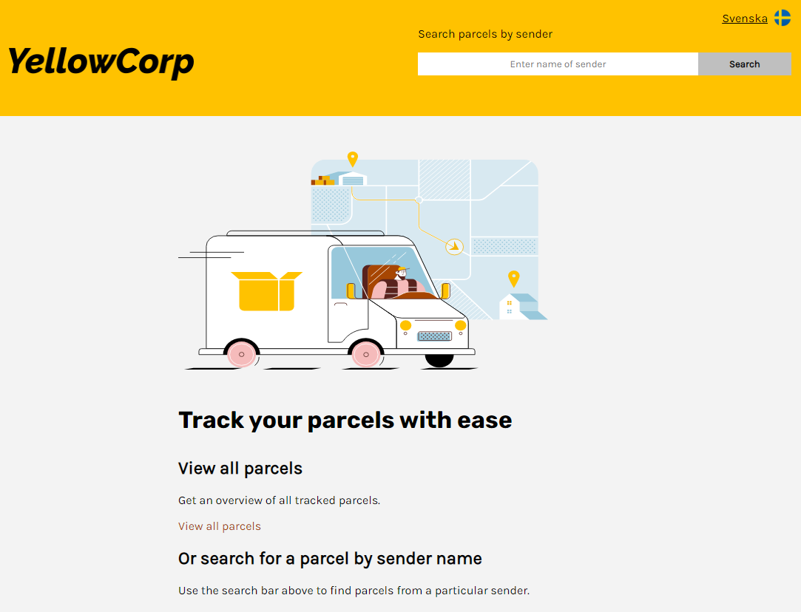
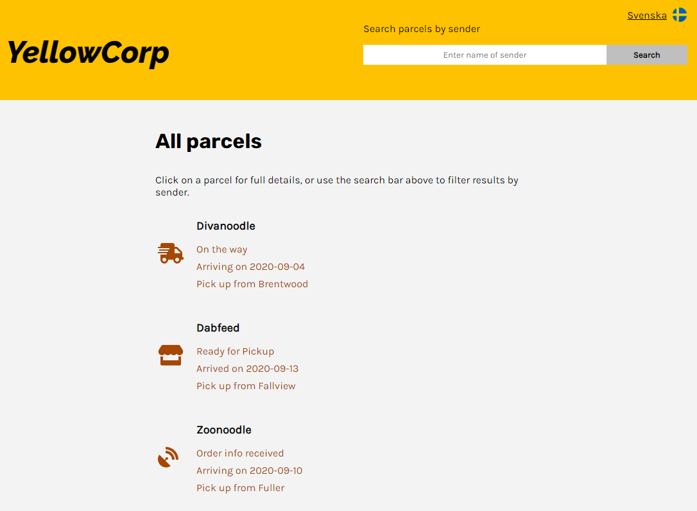
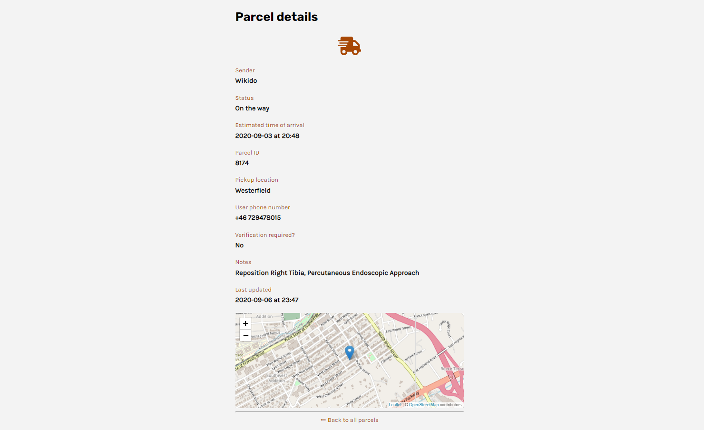
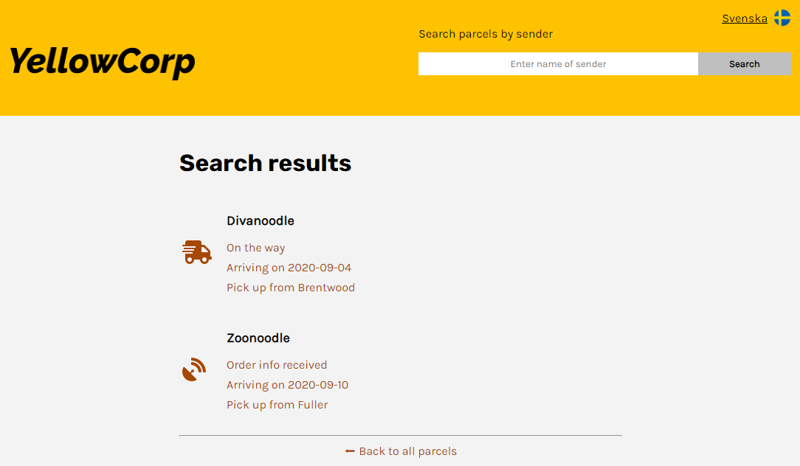

# YellowCorp package tracker

## Description

This web app displays a list of tracked parcels fetched from an API endpoint.

This project was created as an assignment for Software Development Academy (SDA). It was bootstrapped with [Create React App](https://github.com/facebook/create-react-app) and supports major mobile and desktop browsers/layouts.

The web app is hosted by Firebase at https://package-tracker-sda9.web.app/

## Installation

Clone this repository:

`git clone https://github.com/eeels22/package-tracker.git`

In the project directory, run:

`npm install`

Installs the project's dependencies (read on for details) in the local node_modules folder.

`npm start`

Runs the app in the development mode.

Open [http://localhost:3000](http://localhost:3000) to view it in the browser. The page will reload if you make edits. You will also see any lint errors in the console.

`npm run build`

Builds the app for production to the build folder.

It correctly bundles React in production mode and optimizes the build for the best performance.

The build is minified and the filenames include the hashes. The app is then ready to be deployed!

### Deployment

See the section about [deployment](https://facebook.github.io/create-react-app/docs/deployment) in the React documentation for diferent deployment options.

## Dependencies

The app uses the following packages:

### React

<li>react ^17.0.2</li>
<li>react-dom ^17.0.2</li>
<li>react-scripts 4.0.3</li> 

### Navigational components

<li>react-router-dom ^5.2.0</li> 

### Global state management

<li>recoil ^0.2.0</li> 

### Internationalisation

<li>i18next ^20.3.1</li>
<li>react-i18next ^11.10.0</li> 

### Icons

<li>@fortawesome/free-solid-svg-icons ^5.15.3</li>
<li>@fortawesome/react-fontawesome ^0.1.14</li>
<li>@fortawesome/fontawesome-svg-core ^1.2.35</li> 

### Map

<li>leaflet ^1.7.1</li>
<li>react-leaflet ^3.2.0</li> 

## Using the app

### Home page

Get started by clicking the link to view all parcels or search parcels by sender name using the search bar in the header.

_Figure 1: Home page on desktop view_

 

### All parcels page

Get an overview of all tracked parcels. The sender name, order status and matching icon are displayed for each parcel.

Click on a parcel to see further details.

_Figure 2: All parcels page on desktop view_

### Parcel details page

Get more details about a parcel. Some values have been formatted to use more natural language (e.g. "none" instead of "null", "yes / no" instead of "true / false").

_Figure 3: Parcel details on desktop view_

### Search results page

All pages display a search bar in the header, where you can search for parcels by sender.

Search results include part matches, so searching for "oo" will return parcels sent by "Divanoodle" and "Zoonoodle".

Click on a parcel result to see the details.

_Figure 4: Search results showing part matches on desktop view_

### Choose language

The app's default language is English but you can switch to Swedish by click on the language name in the top right.

_Figure 5: Example of a page in Swedish_

## Authors and acknowledgments

Thanks to Eduardo Alvarez (Front End teacher at SDA), the teaching assistants, fellow classmates and Chibi Godzilla.

## Image credits

Van illustration by [DrawKit](https://www.drawkit.io/) \
Icons from [Font Awesome](https://fontawesome.com/)
